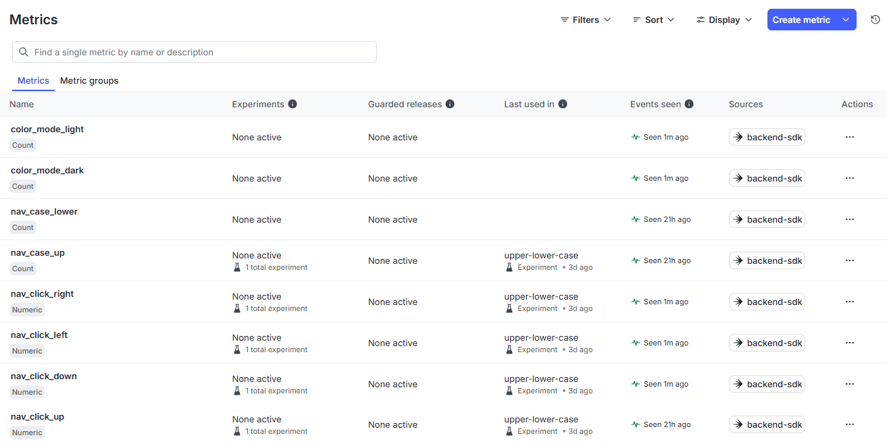
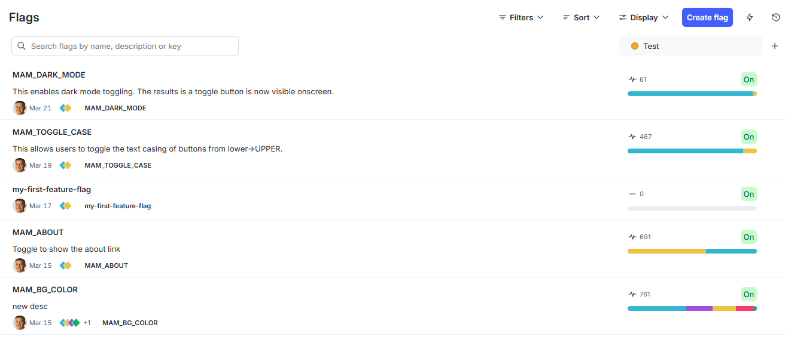
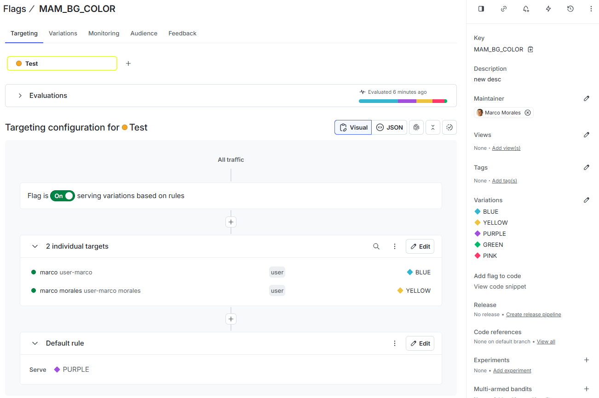

# Dark Matter

Welcome to my humble project.  This is a small Python Flask application with multi-page navigation that utilizes LaunchDarkly capabilities. 

The application promnpts you for a name-only log in (no password), and your primary options are to navitate between four pages in a box formation (upper-left, upper-right, lower-left, lower-right) using "Right", "Left", "Up", and "Down" buttons. 

Along the way, I added a few extra pages and links to help illustrate some LD capabilities. For example: 
- Feature flags control whether an "About" page is visible.
- The top banner background change based on the user by using targeted feature flags.
- A dark mode toggle is available as part of an experiment, also governed by feature flags. I collect metrics as part of this experiment.

## What this application does

- **Login**: Enter your name on the login page; no password is required.
- **Navigation**: After login you land on **Upper Left**. From there you can go **Right** (to Upper Right) or **Down** (to Lower Left). Each of the four corners has two links that follow the same grid (left/right and up/down). Clicks are routed through `/nav/go/...` so LaunchDarkly can record custom events for metrics.
- **Upper Left** → Right: Upper Right; Down: Lower Left  
- **Upper Right** → Left: Upper Left; Down: Lower Right  
- **Lower Left** → Right: Lower Right; Up: Upper Left  
- **Lower Right** → Up: Upper Right; Left: Lower Left  
- Every page shows your name, a logout button, and “from where you came from.”
- **Navigation area** (below the banner): **light / dark mode** toggle (upper right) only when LaunchDarkly flag **`MAM_DARK_MODE`** is on. Choice is stored in `localStorage`. With the flag off, the UI stays **light** and the toggle is hidden. The banner is not affected.
- **Logout** clears the session and returns you to the login page.

## Feature flags (LaunchDarkly)

These are the feature flags by name that I use in this example:

- **MAM_ABOUT** (boolean): When enabled, an “About” link appears and the About page is accessible. That page shows the application name, system details (Python version, OS, memory, CPU), the author name, and the libraries used.
- **MAM_BG_COLOR**: Sets the background color of the **top banner** (welcome, Logout, About when shown, case toggle when shown). The main navigation area stays **white**. Default is `white`; use standard HTML color names (e.g. `lightgray`, `lightblue`).  This page has several options, for when the feature is false, a default color for when it is true, and different colors depending on the username.
- **MAM_TOGGLE_CASE** (boolean): When enabled, a button appears on navigation pages to toggle compass link labels between lower and upper case (for experiments).  This button is designed to test the collection of LD metrics.
- **MAM_DARK_MODE** (boolean, default **off**): When enabled, the nav-area **light/dark** toggle is shown; when off, the nav area stays light and the toggle is hidden.  Ths toggle is designed ot test experimentation to find out, "Do people prefer dark or light mode?"
- **MAM_INLINE_ABOUT** (boolean, default **off**): When enabled, the same **About** content shown on `/about` is rendered **below** the compass on the four navigation corner pages. When off, those pages look as before (no inline block).

The LaunchDarkly SDK key is read from the environment variable **`LAUNCHDARKLY_SDK_KEY`**.

Evaluation uses a **multi-context**: a **user** context (name, role, location) and an **organization** context (team, team size). On each login, role and location are chosen at random from fixed pools, and an organization is chosen at random (HR/5, OPS/10, Sales/15, Finance/20). Those values are stored in the Flask session so flag evaluation stays consistent until logout.

### Navigation custom events (metrics)

Compass clicks go through **`GET /nav/go/<direction>`** (`up`, `down`, `left`, `right`). Each valid click sends a LaunchDarkly custom event via `LDClient.track()`:

| Event key | When it fires |
|-----------|----------------|
| `nav_click_up` | User chose **Up** from a page where that move is allowed |
| `nav_click_down` | User chose **Down** |
| `nav_click_left` | User chose **Left** |
| `nav_click_right` | User chose **Right** |

Each `nav_click_*` event includes `data`: `from_page`, `to_page` (slugs like `upper-left`).

Case preference is **not** attached to compass clicks anymore. Use the toggle event instead:

| Event key | When it fires |
|-----------|----------------|
| `nav_case_toggle_clicked` | User clicked **switch->CASE** / **SWITCH->case** (only when `MAM_TOGGLE_CASE` is enabled) |

`nav_case_toggle_clicked` includes `data`: `previous_case`, `new_case` (`lower` or `upper`), and `from_page`.

| Event key | When it fires |
|-----------|----------------|
| `ui_color_mode` | Reports effective nav color mode: `data.mode` is **`light`** or **`dark`**. If **`MAM_DARK_MODE`** is off, the server sends **`light`** once per login session. If **`MAM_DARK_MODE`** is on, the browser POSTs to `/api/ui-color-mode` when the page loads (current preference) and when the user toggles (deduped per tab session for unchanged mode). |

| Event key | When it fires |
|-----------|----------------|
| `inline_about` | **Navigation corner pages only** (not `/about`). After **load**, the browser POSTs **`load_ms`** to `/api/inline-about-load`. The server emits **`inline_about`** with `metric_value` = load time in ms, and `data`: `mam_inline_about` (whether **`MAM_INLINE_ABOUT`** was on for that load), `load_ms`. Use a **numeric** custom metric in LD on this event to compare load times with vs without the flag. |

**Event filters in LaunchDarkly:** reference custom data fields on the event (e.g. `new_case`, `from_page`) depending on your UI; naming often matches the keys sent in `track(..., data={...})`.

In LaunchDarkly, create **custom metrics** that count these event keys (e.g. one per `nav_click_*` direction, plus one for `nav_case_toggle_clicked`). Attach them to your experiment as needed.

---

## My Stack
I developed this code on a Win11 machine with WSL enabled.
The primary OS is Ubuntu 24.
Python verison 3.12.3
I use Python Virtual environments, as noted below.
I developed with Cursor.  This is my first major usage of that IDE for a multi-session test.  Previously, I used cursor for simple projects, typically 15-20 minutes.

## Prompt used to create this application

This was the first prompt, but not the only prompt.

> Let's create a python application named "dark-matter"
>
> This is a python application that uses flask.
> When you build this application, include a @README.md that tells the user what the application is about, and the prompt that I used. Also include instructions for how to build the application.
>
> The application can run from the command line with python 3. The application can also run from a docker container.
> include a multi-stage docker build that creates an image.
> Include a requirements.txt file with the necessary dependencies.
> Please use LaunchDarkly for python to enable feature flags.
> The application is a simple flask application with multiple pages.
> Start by asking the person for their login, which is only their name. There is no password.
> When they log in, they are taken to a page, which we'll call upper-left. The navigation options are "right" or "down." Right takes you to upper-right, and down takes you to lower-left.
> Lower-left has two navigation options: right, and up. Right takes you to lower-right, and up takes you to upper-left.
> lower-right has two navigation options: up and left. Up takes you to upper-right, left takes you to lower-left.
> Upper-right has two navigation options: left and down. Left takes you to upper-left, and down takes you to lower-right.
> All pages display your name, and a logout button.
> All pages also display from where you came from.
> Logout starts all over.
> Let's have a few feature flags:
> - One feature flag toggles the state of the "about" page, which will display the name of the application, plus details about the underlying system such as python version, OS, memory, and other interesting details. Also include the name of the author and the libraries used within. This is a boolean value. This flag is named MAM_ABOUT.
> - Another feature flag changes the default background color. The default is "white" and the options are standard HTML values by name. This flag is named MAM_BG_COLOR.
> The Launchdarkly API token is named LAUNCHCDARKLY_SDK_KEY.

Since the initial prompt, I added more to separate the top and bottom into a banner + body section.
To better support contrast, I modified the banner to enclose text in persistent backgrounds.
I added a toggle for dark/light mode.  To support this, I asked to change the color scheme to better support the different contrast requirements.
Along the way, I made changes to navigation, words, the about page, and more and this resulted in shifting logic from the python application to the *.html pages, to a reusable banner section, to updates in  the .css files to better support text switches.  I reviewed about 90% of the code changes suggested to me...eerily spot-on.

---

## Prerequisites (Python)

- **Python 3.10+** (3.12 matches the Docker base image in `python/Dockerfile`).
- **`pip`** and a virtual environment (**`venv`**) are recommended for local development.
- Optional: **Docker** to build and run the container image.
- Optional: a **LaunchDarkly** project and **SDK key** for live feature flags.

## Configuration

Set environment variables in the shell (or your process manager / container). The app reads at least:

| Variable | Purpose |
|----------|---------|
| `LAUNCHDARKLY_SDK_KEY` | Server-side SDK key for LaunchDarkly. If unset, flags use defaults (off / `white` banner). |
| `LAUNCHDARKLY_API_KEY` | Optional; not required by this sample app’s runtime (documented for your own tooling). |
| `SECRET_KEY` | Flask session signing secret (defaults in code for dev only). |
| `PORT` | Listen port (default **5000**). |
| `FLASK_DEBUG` | Set to `1` to enable Flask debug mode. |

Example (sizes illustrative only):

```bash
export LAUNCHDARKLY_SDK_KEY=sdk-8chars-4chars-4chars-4chars-12chars
export LAUNCHDARKLY_API_KEY=api-8chars-4chars-4chars-4chars-12chars
```

## Build

### Install dependencies (local)

From the `python/` directory, create a venv and install packages into it:

```bash
python3 -m venv venv
source venv/bin/activate   # Windows: venv\Scripts\activate
pip install -r requirements.txt
```

There is no separate compile step; `pip install` is the build for local runs.

### Docker image

From the **repository root**:

```bash
docker build -f python/Dockerfile -t dark-matter .
```

This uses the multi-stage `python/Dockerfile` and expects the build context to include the `python/` tree.

## Run

### Local (Flask)

With your working directory **`python/`** and (recommended) venv activated:

```bash
python app.py
```

The app listens on `http://127.0.0.1:5000` unless `PORT` is set.

Optional:

```bash
export SECRET_KEY=your-secret-key
export PORT=8080
python app.py
```

### Docker

```bash
docker run -p 5000:5000 -e LAUNCHDARKLY_SDK_KEY=sdk-xxxx-your-key dark-matter
```

Omit `-e LAUNCHDARKLY_SDK_KEY=...` to run with default flag behavior. Open `http://localhost:5000`.

### Script: inline page load + `MAM_INLINE_ABOUT` (CSV)

With the Flask app running, this script logs in as `user1` … `user300`, measures time for the first page (login POST + redirect to the nav page), reads **`MAM_INLINE_ABOUT`** via **`GET /api/ld-flags`** (same session and multi-context as the app), and writes **`inline_time_YYYYMMDD_HHMMSS.csv`** in the project root (timestamp = test start).  
After each successful login/page load, it also POSTs to `/api/inline-about-load` so the server can emit the LaunchDarkly metric event `inline_about`.

From the `python/` directory (with the Flask app running):

```bash
export DARK_MATTER_BASE_URL=http://127.0.0.1:5000   # optional
python scripts/evaluate_inline_page_load.py
```

The app still needs **`LAUNCHDARKLY_SDK_KEY`** if you want live flag values from LaunchDarkly; the script does not use the SDK directly.

Columns: `username`, `start_time`, `end_time`, `page_load_time_us`, `mam_inline_about` (`true` / `false`).

### Quick reference

| Step | Command |
|------|---------|
| Install deps | From `python/`: `pip install -r requirements.txt` (preferably in a venv) |
| Run | `python app.py` |
| Docker | From repo root: `docker build -f python/Dockerfile -t dark-matter .` then `docker run -p 5000:5000 … dark-matter` |

## Ideas, musings, next steps

These are notes to self, and some are aspirational.

Per the ingredients, and when time permits, I'd like or need to do the following:
- Metrics
   - Create a metric for one of my FF
   - Create an experiment that uses one of my FF and the metric.
   - Run the experiment long enough to gather data to make an informed decision.
- AI Configs
   - Implmenent an AI configuration in my application to change prompts
   - Test variations of prompts and models to see which is most effective, based on metrics.
   - (Time sounds like a good one.)
   - For fun, maybe create a metric based on the size of the payload.
- Integrations
   - Explore one of the many integrations
   - See https://launchdarkly.com/docs/integrations
   - Maybe: CloudTrail Lake (I haven't tested this before)
   - Maybe: Elk (I would need to provision an Elk stack)
   - GHA: Flag evaluations?  That would be new to mem.
   - GHA find references
   - GHA Copilot with VSCode
   - GH code referencces
   - Maybe the point is: there is quite a lot to explore.
- Create a terraform script to deploy to my AWS instance.
   - I'll use my envvars to drive the TF script for my AWS secrets
   - I'll likely deploy to ECS
   - Deploy 2 instances, and see about targeting one instance with FF.  This will require me to better understand how to use LD.

## Observations, issues, bugs
- I  tested some CURL commands, the REST API docs look to be small.
- I am testing the CLI
   - https://github.com/launchdarkly/ldcli
   - Of course, I prefer the straight CLI over the npm cli
- I noticed that rapid navigation clicking may send you to the login page...may need investigation.

# Images

This is a screenshot of the metrics page, showing activity for several mtrics.



This is the screenshot of the FF page, showing the list of FFs in this project, plus one that is unused.



This screenshot shows the details for a single feature flag - MAM_BG_COLOR.  The details highlight the default values for different targets.


